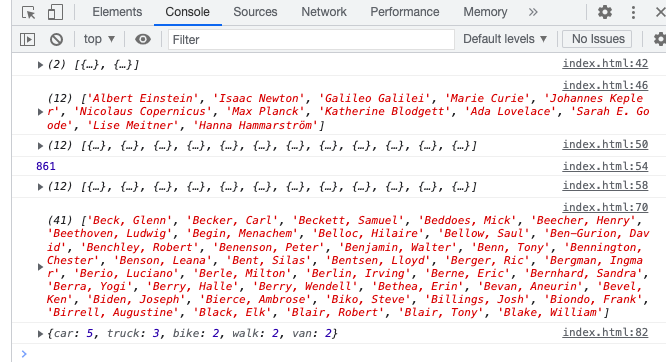

# Javascript30-4
 This is a 30 day JavaScript Challenge. Challenge #4 Arrays
 
## Table of contents

- [Overview](#overview)
  - [The challenge](#the-challenge)
  - [Screenshot](#screenshot)
  - [Links](#links)
- [My process](#my-process)
  - [Built with](#built-with)
  - [What I learned](#what-i-learned)
  - [Continued development](#continued-development)
  - [Useful resources](#useful-resources)
- [Author](#author)

## Overview

### The challenge

- Build out the project to the designs provided

### Screenshot




### Links

- Solution URL: [https://github.com/kryde507/JavaScript30-4](https://github.com/kryde507/JavaScript30-4)

## My process

### Built with

- Vanilla JavaScript

### What I learned

In this project I learned about I learned array methods, specifically the reduce method.


The following JavaScript snippet is used to determine the nuber of occurences of an item in the array:
```js
const transportation = data.reduce((allTransports, transport) => {
            const currCount = allTransports[transport] ?? 0;
            return {
                ...allTransports,
                [transport]: currCount + 1,
            };
        }, {});
```


### Continued development

I would like to continue using the array methods used in this excercise and see them used in practise. 

### Useful resources

- [MDN Array Reduce Method](https://developer.mozilla.org/en-US/docs/Web/JavaScript/Reference/Global_Objects/Array/reduce) - This helped me understand the reduce() method.

## Author

- GitHub - [KRyde507](https://github.com/kryde507)

